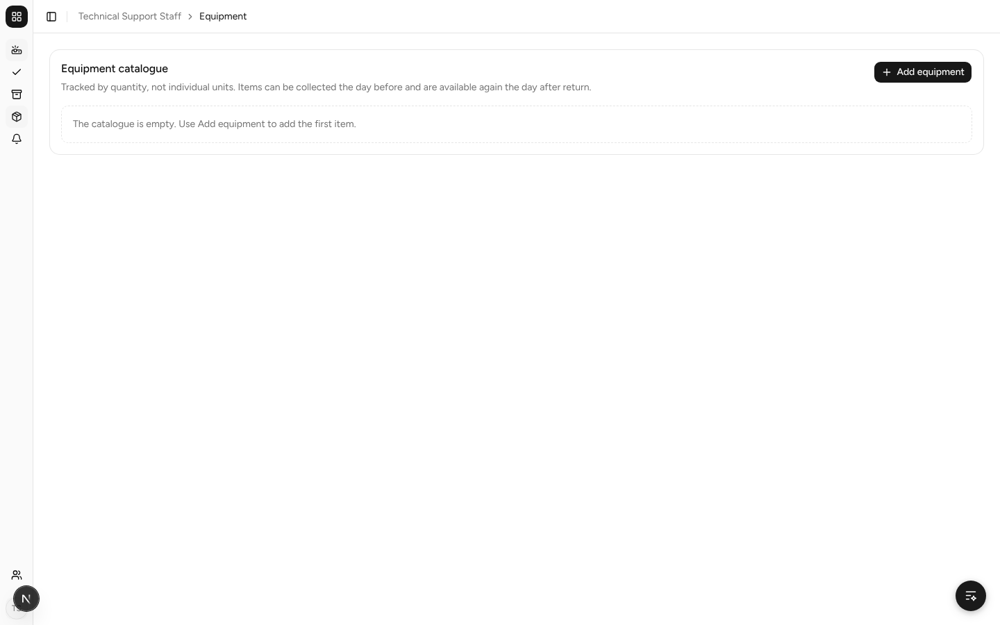
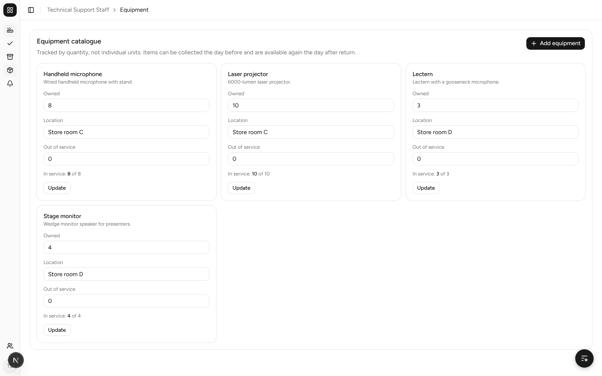
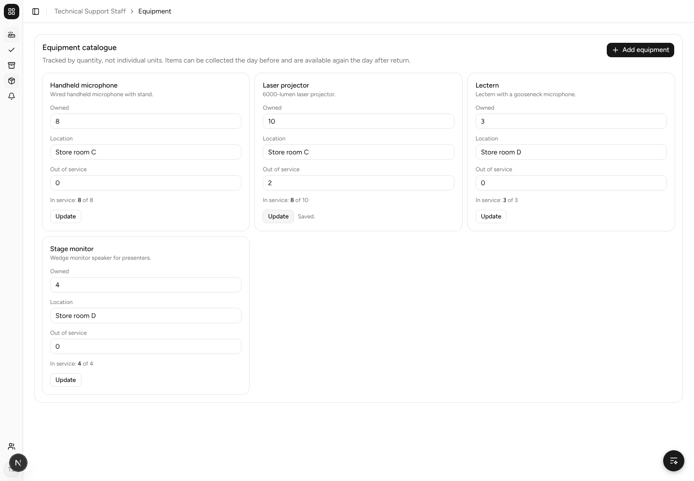
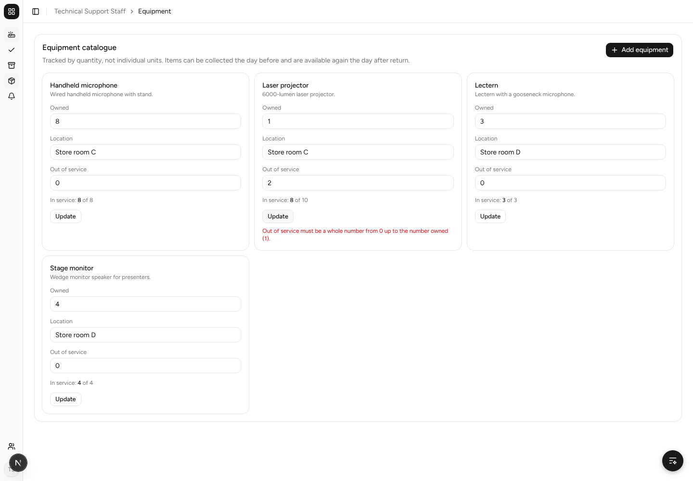
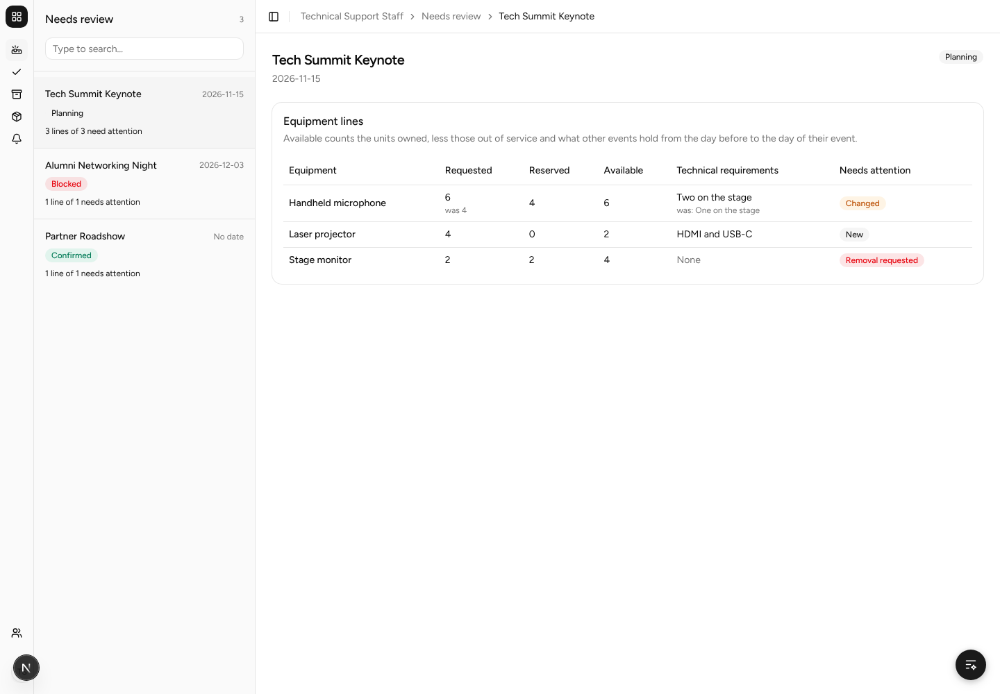

# SPM-17 before and after

Taken on the local stack with `scripts/seed-equipment-review`, signed in as
`support@test.com`. Before is `main` (the Equipment page is unchanged by
SPM-273); after is `feat/spm-17-mark-equipment-out-of-service`.

## Equipment page

Before, the page read an in-memory stub, so it showed an empty catalogue while
the database (and the coordinators' picker) held four items. After, it shows
the real catalogue, with **Owned**, **Out of service** and the units in service.

| Before | After |
| --- | --- |
|  |  |

## Setting units out of service (AC1, AC2, AC3)

2 Laser projectors set out of service (*In service: 8 of 10*), then Owned lowered
to 1, which is refused.

| Saved | Refused |
| --- | --- |
|  |  |

## Availability on Needs review (AC4)

With 2 Laser projectors out of service, Tech Summit Keynote's availability drops
from 4 to 2.

