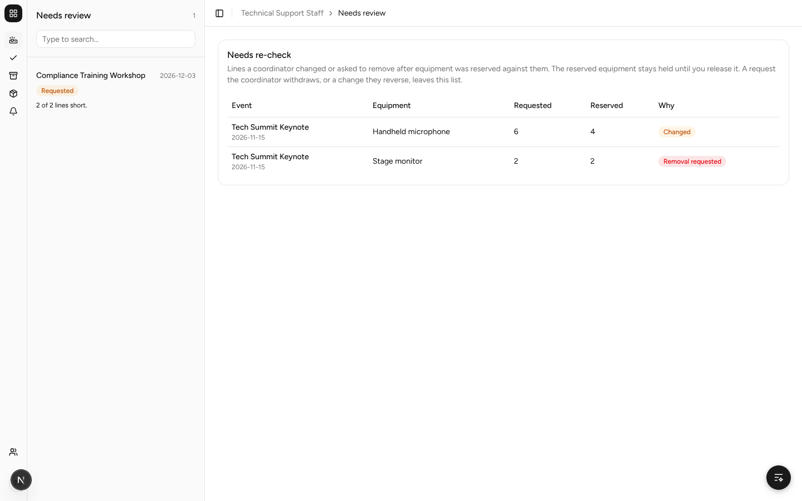
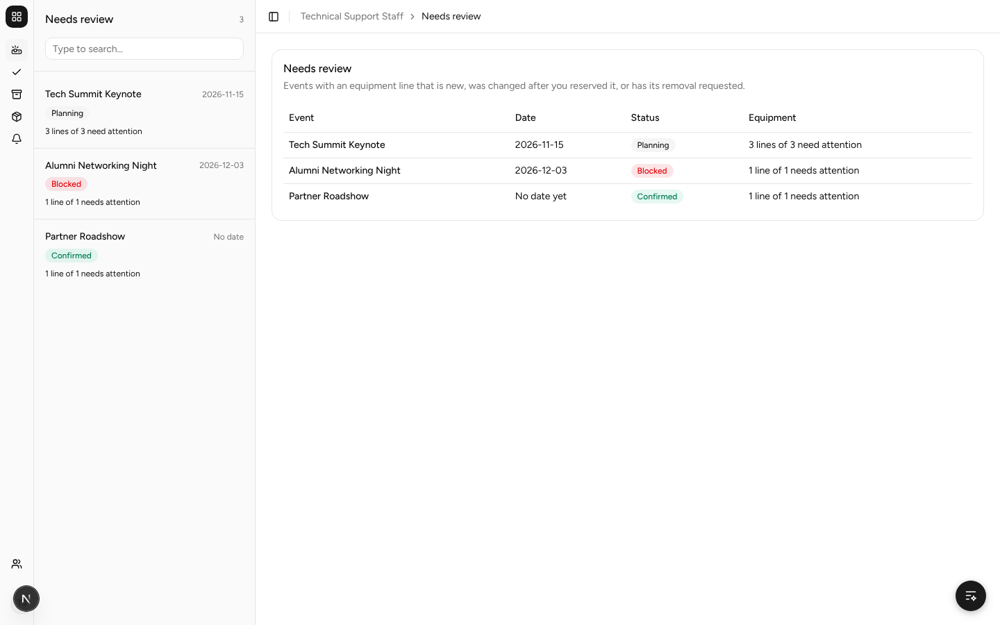
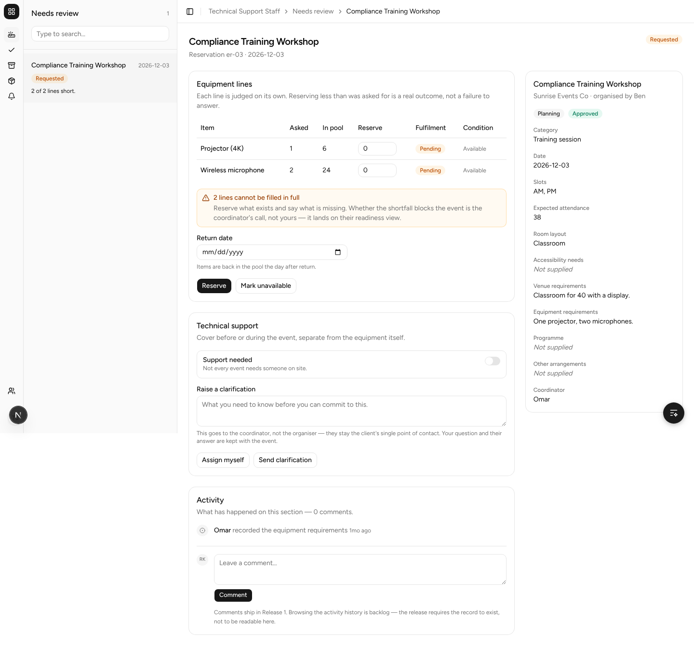
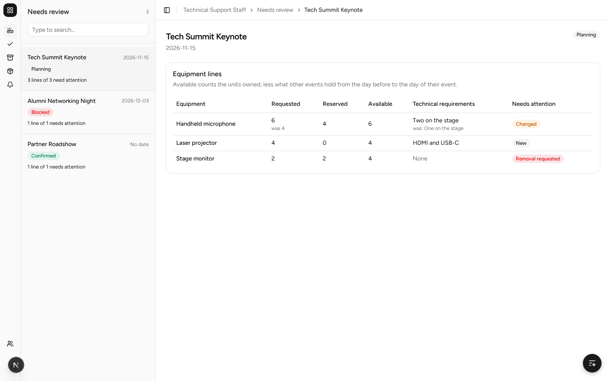
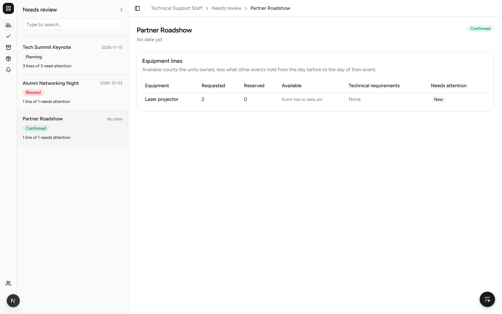
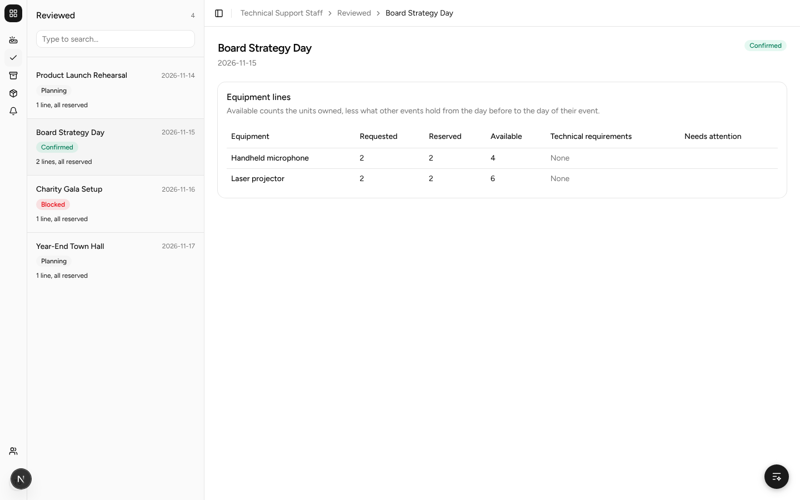
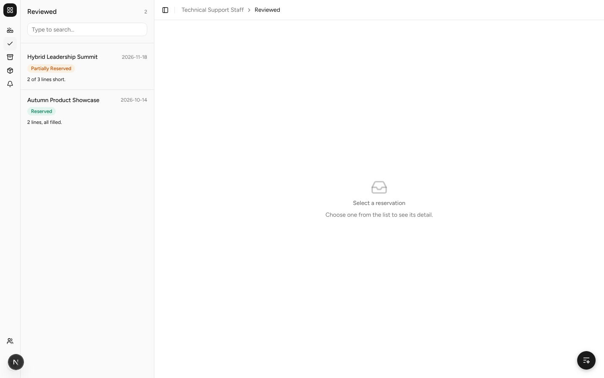
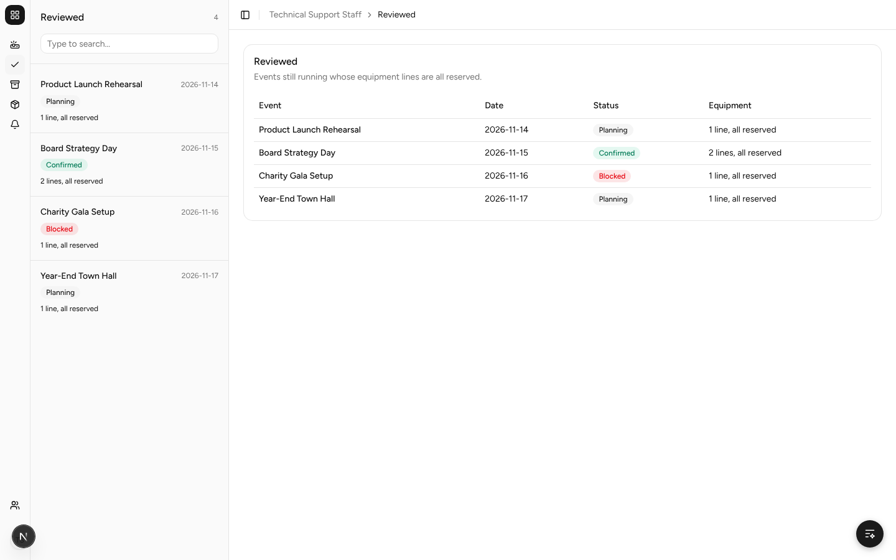
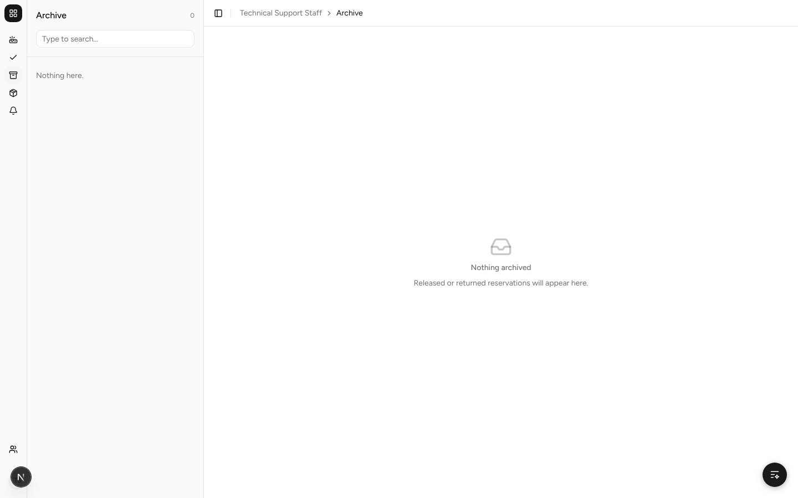
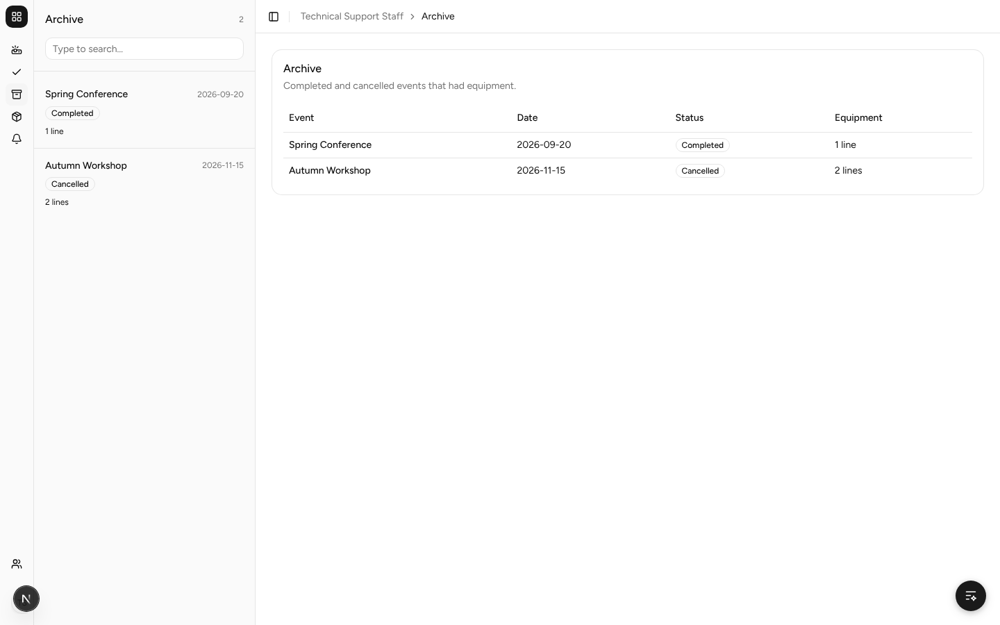

# SPM-273 before and after

Taken on the local stack with `scripts/seed-equipment-review`, signed in as
`support@test.com`. Before is `main` at `c60f854`; after is
`feat/spm-273-see-equipment-needing-attention`.

## Needs review

Before, the card showed only changed and removal-requested lines, and the
sidebar listed a placeholder event. After, events with new lines are listed
too, and the sidebar matches the table.

| Before | After |
| --- | --- |
|  |  |

## Event page

Before, a wireframe reservation with placeholder controls. After, the real
lines with their marks and the units available.

| Before | After |
| --- | --- |
|  |  |

## Undated event (AC4) and an event opened from Reviewed

| Undated | From Reviewed |
| --- | --- |
|  |  |

## Reviewed and Archive

Before, placeholder sidebars beside an empty state. After, real lists.

| Before | After |
| --- | --- |
|  |  |
|  |  |
