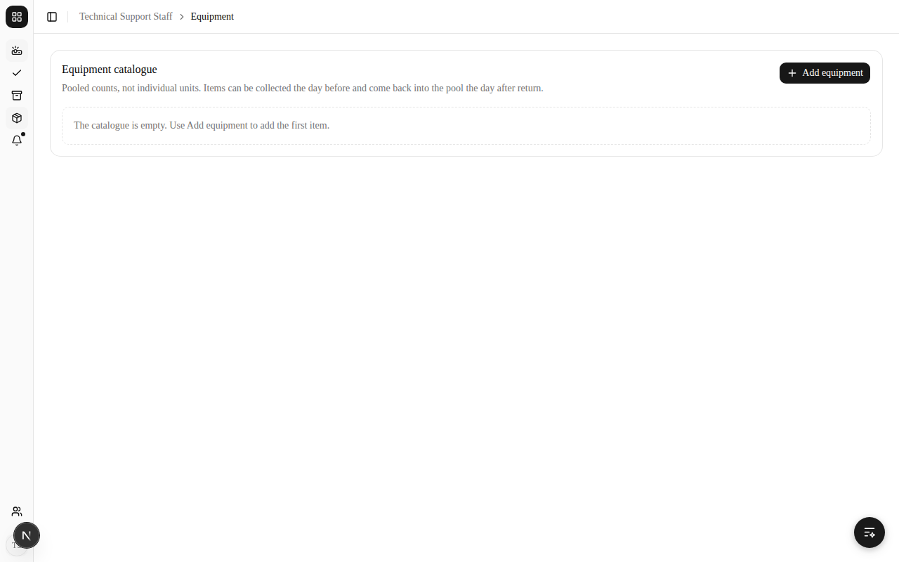
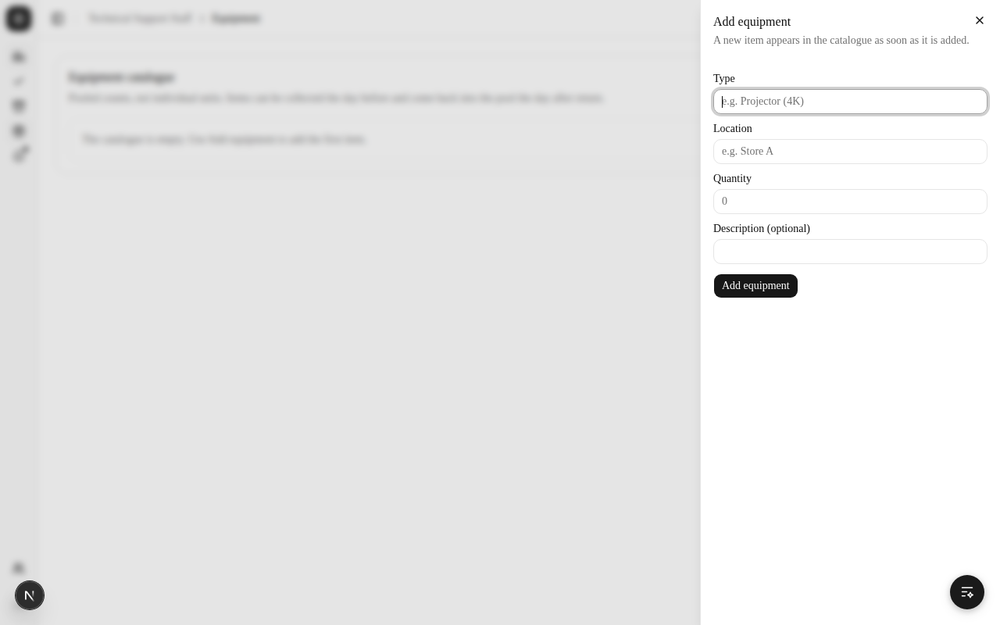
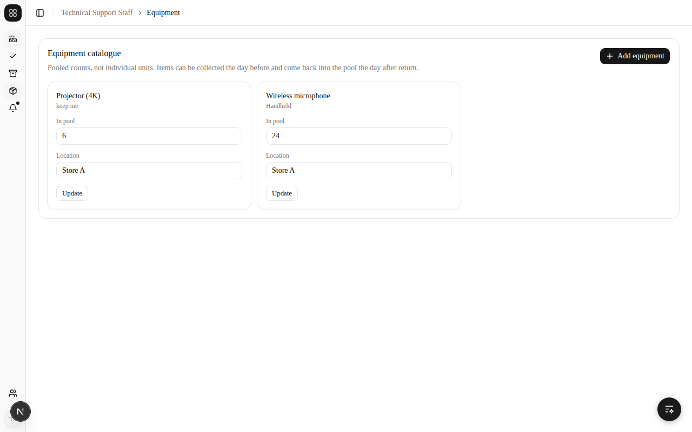
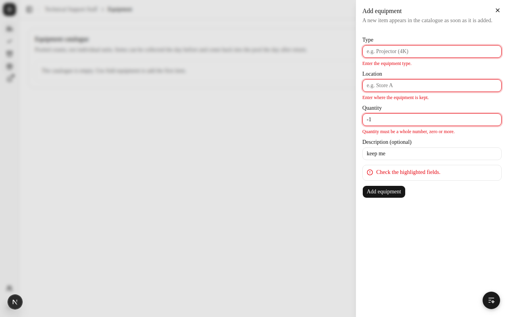
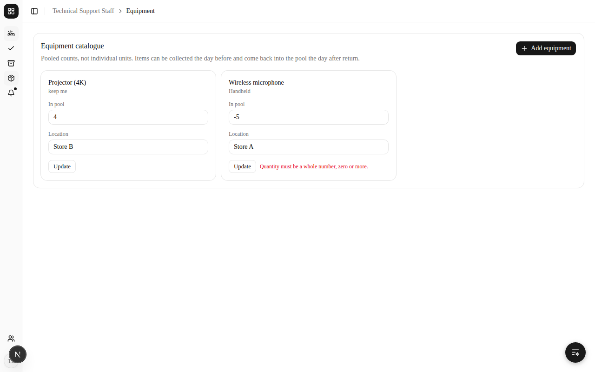
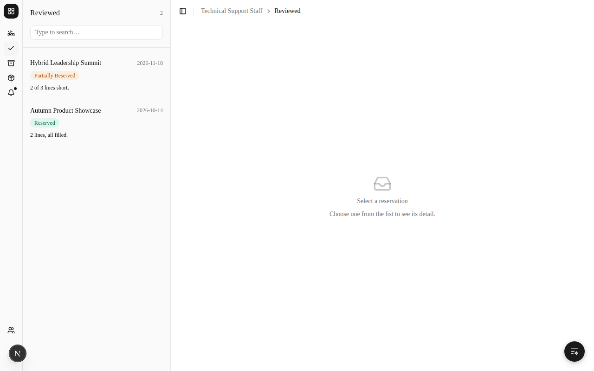
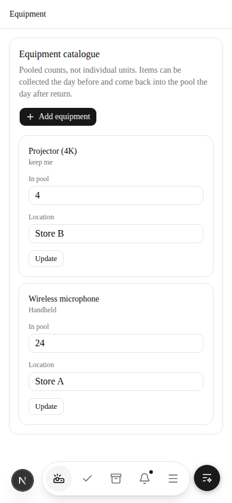
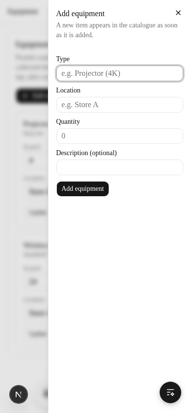

# Equipment Catalogue Manual Tests (SPM-40)

## Overview
Manual browser tests for Technical Support Staff maintaining the equipment
catalogue on the **Equipment** page (`/staff/technical/equipment`, the box icon in
the sidebar): adding equipment from the **Add equipment** button and updating the
quantity and location of the cards.

These cases are registered as `TC-EQCAT-001`–`TC-EQCAT-008` in
[`../tests/manual-registry.csv`](../tests/manual-registry.csv). When you run
them, report each in the PR description's `## Manual test results` table — CI
records it in [`manual-runs.csv`](../tests/manual-runs.csv) when the PR merges.

They were `TC-EQUIP-001`–`TC-EQUIP-008` until 2026-10-04; `TC-EQUIP` now
belongs to SPM-41's equipment requirement cases.

---

## Test Environment Setup

### Prerequisites
- Running: `pnpm dev:local` (open it at `http://localhost:3000`)
- **The catalogue is an in-memory stub for now.** There is no Supabase adapter for
  `equipment_item` yet (see `buildEquipmentCatalogue` in
  `src/composition/container.ts`), so records live as long as the dev server and
  are lost on restart. **Restart the dev server before running TC-EQCAT-001**, or
  the catalogue will not be empty.

### Test Accounts (password `TestPass123!`)
- `support@test.com` (Technical Support Staff)
- `ops@test.com` (Event Operations Manager)

---

## Run record

Run on 2026-10-03, driven through a headless browser by Claude for Arin, on the
branch before its commit of this doc. **This run used
the in-memory stub and a sandbox-only stand-in for Supabase sign-in**, because no
Supabase project was available in the sandbox. Treat it as a sandbox result,
not a run against the real stack: re-run against `pnpm dev:local` with a real
sign-in and report it in your PR.

| Case | AC | Result | Screenshot |
| --- | --- | --- | --- |
| TC-EQCAT-001 | AC4 | Pass | `01-equipment-page-empty` |
| TC-EQCAT-002 | AC1 | Pass | `02-add-equipment-panel`, `03-two-cards` |
| TC-EQCAT-003 | AC1 | Pass | `04-invalid-add-refused` |
| TC-EQCAT-004 | AC2, AC3 | Pass | `05-update-persists-after-reload` |
| TC-EQCAT-005 | AC2 | Pass | `06-invalid-update-refused` |
| TC-EQCAT-006 | AC1 | Pass | `07-reviewed-has-no-catalogue` |
| TC-EQCAT-007 | AC1, AC2 | Pass | `08`, `09` |
| TC-EQCAT-008 | Role | Pass | `10-other-role-cannot-open-equipment` |

Screenshots are in [`../screenshots/`](../screenshots), named
`2026-10-03-spm-40-<nn>-<name>.png`.

---

## TC-EQCAT-001 The catalogue starts empty (AC4)

**Steps**
1. Restart the dev server. Log in as `support@test.com`.
2. Click **Equipment** in the sidebar (box icon, `/staff/technical/equipment`).

**Expected Result**
- The **Equipment catalogue** card says "The catalogue is empty. Use Add equipment to add the first item."
- None of the old placeholder items (Projector (4K), Wireless microphone, ...) are listed.

---

## TC-EQCAT-002 Add equipment (AC1)

**Steps**
1. Click **Add equipment** (top right of the card). A panel opens on the right.
2. Enter Type `Projector (4K)`, Description `Ceiling-mount capable`, Quantity `6`,
   Location `Store A`, and click **Add equipment** in the panel.
3. Add a second item the same way: Type `Wireless microphone`, no description, Quantity `24`, Location `Store A`.

**Expected Result**
- The panel closes after each add, and the item appears at once as its own card.
- Each card shows the type, the description under it (when there is one), and the
  quantity and location in editable fields with an **Update** button.
- The "catalogue is empty" message is gone.

---

## TC-EQCAT-003 An invalid item is refused (AC1)

**Steps**
1. Open the **Add equipment** panel. Leave Type and Location blank, enter Quantity `-1`
   and Description `keep me`, and click **Add equipment** in the panel.

**Expected Result**
- Errors under Type ("Enter the equipment type."), Location ("Enter where the equipment is kept.")
  and Quantity ("Quantity must be a whole number, zero or more."), plus "Check the highlighted fields."
- The panel stays open with what was typed (`-1`, `keep me`) kept. No card is added.

---

## TC-EQCAT-004 Update quantity and location (AC2, AC3)

**Steps**
1. On the Projector (4K) card, change **Quantity** to `4` and **Location** to `Store B`.
2. Click **Update**, then reload the page.

**Expected Result**
- The card shows "Saved." After the reload Projector (4K) still shows `4` at `Store B`.
- The Wireless microphone card is unchanged (`24`, `Store A`).
- The screen reports the quantity available and nothing finer (no per-unit records).

---

## TC-EQCAT-005 A bad update is refused (AC2)

**Steps**
1. On the Wireless microphone card, change **Quantity** to `-5` and click **Update**. Reload.

**Expected Result**
- "Quantity must be a whole number, zero or more." appears on that card.
- After the reload Wireless microphone is still `24`.

---

## TC-EQCAT-006 The catalogue lives only on the Equipment page (AC1)

**Steps**
1. Open **Needs review** (`/staff/technical`), **Reviewed** and **Archive** in turn.

**Expected Result**
- None of them shows the equipment catalogue; it is reached from **Equipment** in the sidebar.

---

## TC-EQCAT-007 Usable at phone width (AC1, AC2)

**Steps**
1. Open `/staff/technical/equipment` in a 390px-wide window. (On a phone, **Equipment** is in the
   menu drawer behind the last button of the bottom bar, not in the bar itself.)
2. Tap **Add equipment**.

**Expected Result**
- Cards stack one per row with labelled **Quantity** and **Location** fields and **Update**.
- The Add equipment panel opens beside a sliver of the page, and every field fits on screen.
- The page does not scroll sideways.

---

## TC-EQCAT-008 Other roles cannot open the Equipment page

**Steps**
1. Log in as `ops@test.com` and open `/staff/technical/equipment` directly.

**Expected Result**
- The page responds 404 and no catalogue content is shown. The blank page is the app's
  existing not-found behaviour for a role mismatch, not something specific to this feature.

