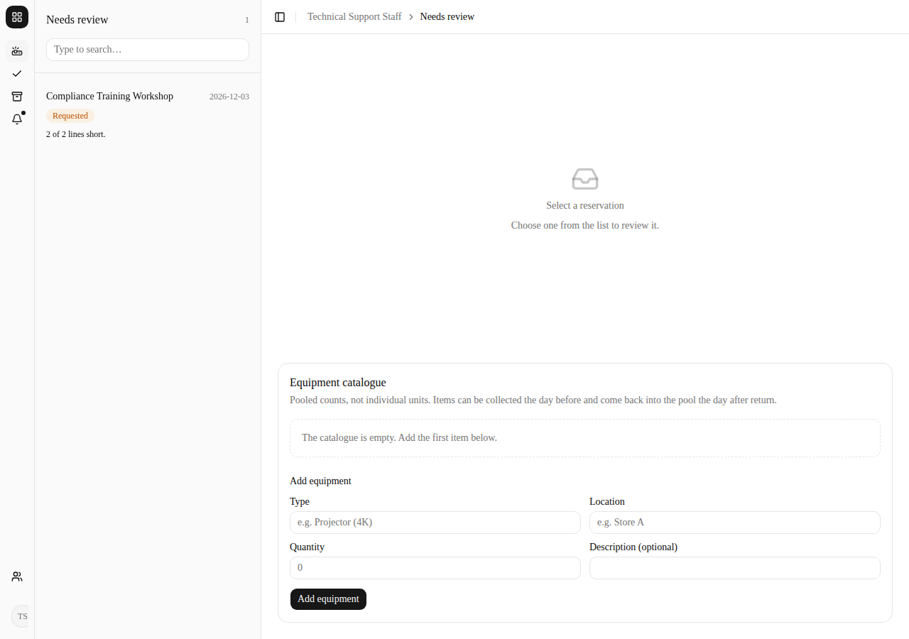
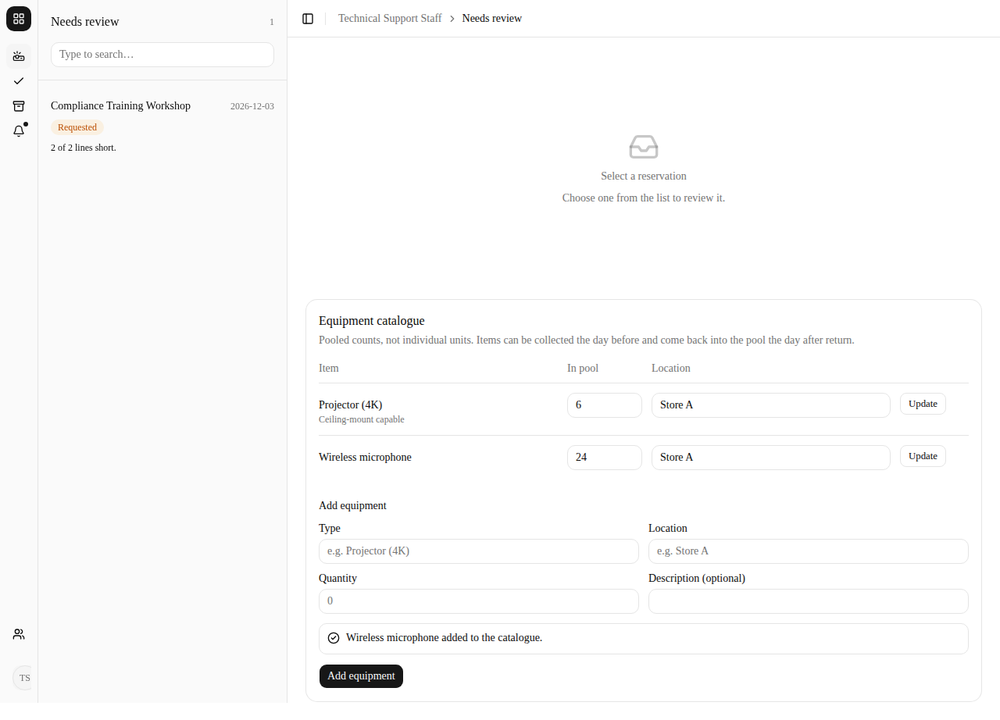
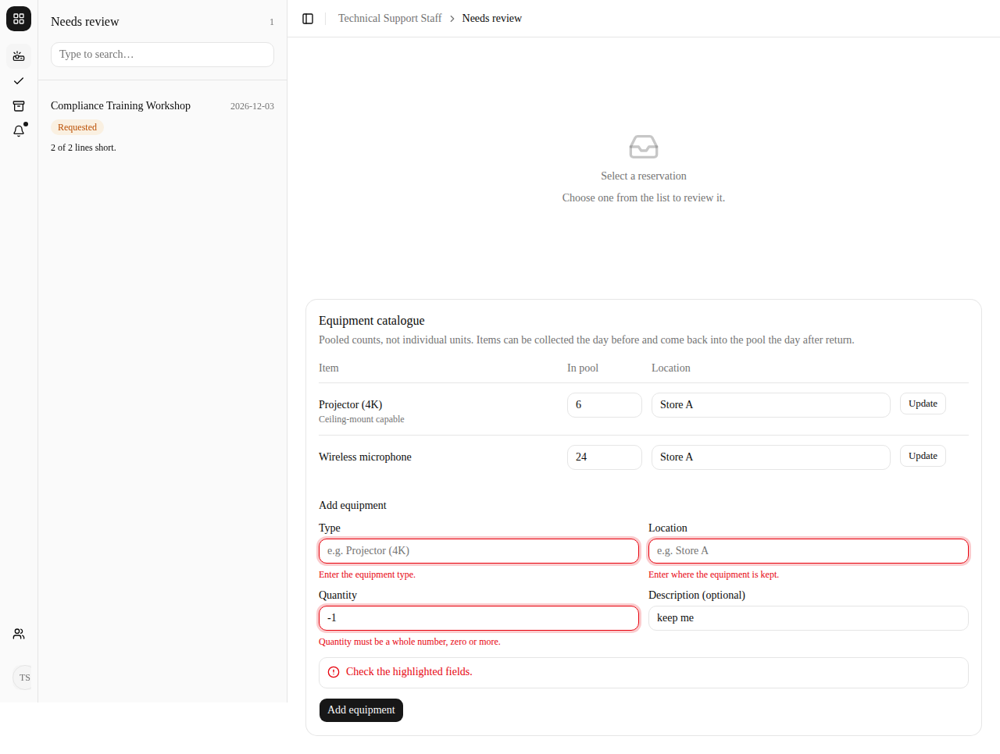
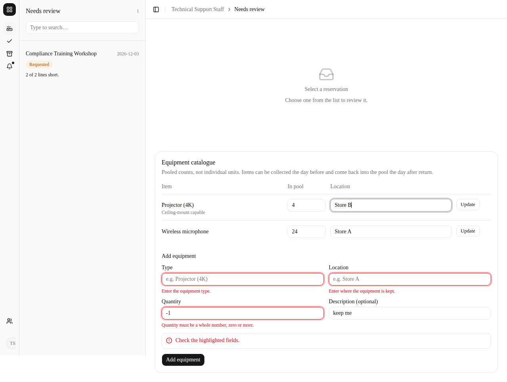
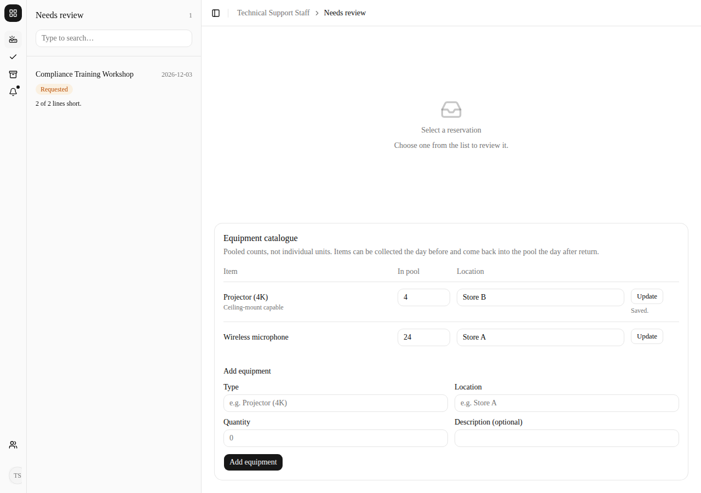
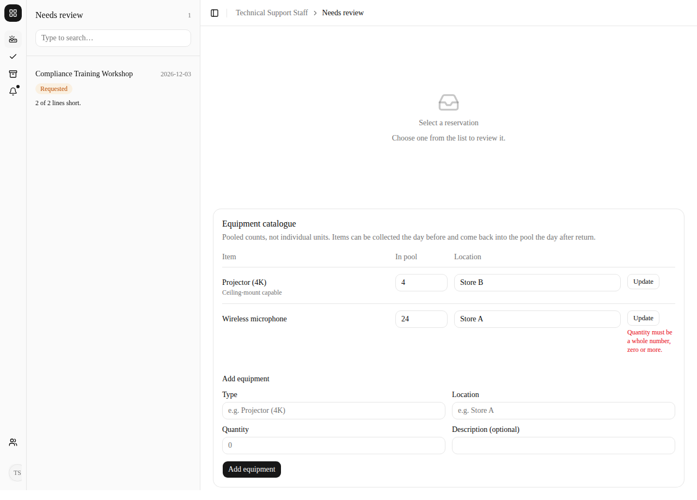
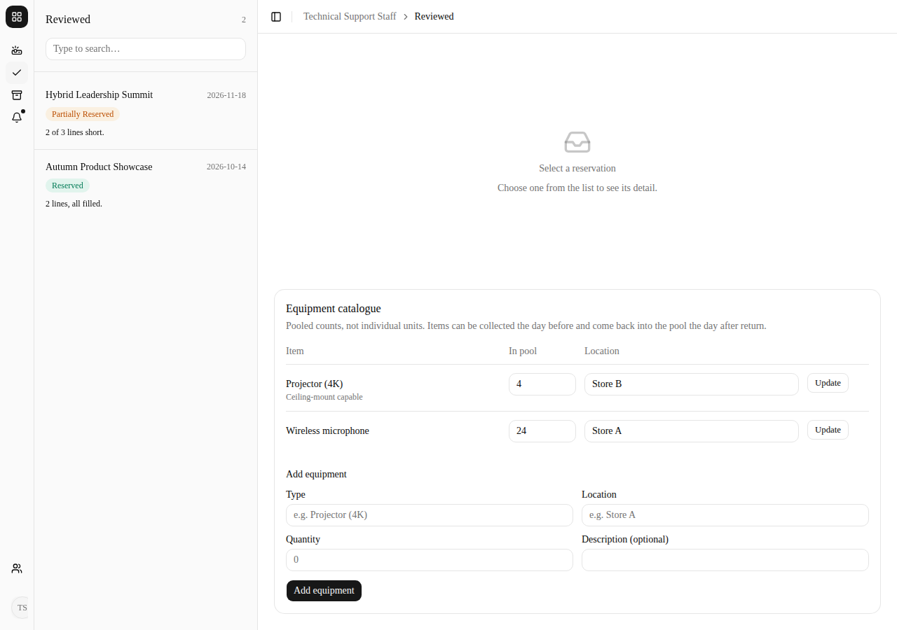
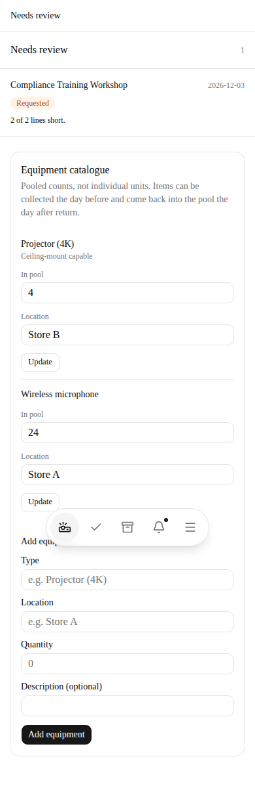

# Equipment Catalogue Manual Tests (SPM-40)

## Overview
Manual browser tests for Technical Support Staff maintaining the equipment
catalogue: creating equipment records and updating the quantity and location of
existing ones.

These cases are registered as `MT-0014`–`MT-0021` in
[`../tests/test-registry.csv`](../tests/test-registry.csv). When you run them
against the local Supabase stack, tick the boxes below **and** set `Status` and
`LastPassedDate` on the matching rows. CI cannot verify a manual case for you.

---

## Test Environment Setup

### Prerequisites
- Running: `pnpm dev:local`
- **The catalogue is an in-memory stub for now.** There is no Supabase adapter for
  `equipment_item` yet (see `buildEquipmentCatalogue` in
  `src/composition/container.ts`), so records live as long as the dev server and
  are lost on restart. **Restart the dev server before running TC-EQUIP-001**, or
  the catalogue will not be empty.

### Test Accounts (password `TestPass123!`)
- `support@test.com` (Technical Support Staff)
- `ops@test.com` (Event Operations Manager)

---

## Run record

First run on 2026-09-30, driven through a headless browser by Claude for Arin,
against commit `dfcc33d`. **This run used
the in-memory stub and a sandbox-only stand-in for Supabase sign-in**, because no
Supabase project was available in the sandbox. The registry rows are therefore
left as `Not Executed`: re-run against `pnpm dev:local` and set `Status` yourself.

| Case | AC | Result | Screenshot |
| --- | --- | --- | --- |
| TC-EQUIP-001 | AC4 | Pass | `01-catalogue-starts-empty` |
| TC-EQUIP-002 | AC1 | Pass | `02-two-records-created` |
| TC-EQUIP-003 | AC1 | Pass | `03-invalid-create-refused` |
| TC-EQUIP-004 | AC2, AC3 | Pass | `04`, `05`, `06` |
| TC-EQUIP-005 | AC2 | Pass | `07-invalid-update-refused` |
| TC-EQUIP-006 | AC1 | Pass | `08-catalogue-on-reviewed-section` |
| TC-EQUIP-007 | AC1, AC2 | Pass | `09-catalogue-on-phone-width` |
| TC-EQUIP-008 | Role | Pass | `10-other-role-cannot-open-catalogue` |

Screenshots are in [`../screenshots/`](../screenshots), named
`2026-09-30-spm-40-<nn>-<name>.png`.

---

## TC-EQUIP-001 The catalogue starts empty (AC4)

**Steps**
1. Restart the dev server. Log in as `support@test.com`.
2. Open **Needs review** (`/staff/technical`) and find the **Equipment catalogue** card.

**Expected Result**
- The card says "The catalogue is empty. Add the first item below."
- None of the old placeholder items (Projector (4K), Wireless microphone, ...) are listed.

---

## TC-EQUIP-002 Create equipment records (AC1)

**Steps**
1. In **Add equipment**, enter Type `Projector (4K)`, Description `Ceiling-mount capable`,
   Quantity `6`, Location `Store A`, and click **Add equipment**.
2. Add a second record: Type `Wireless microphone`, no description, Quantity `24`, Location `Store A`.

**Expected Result**
- Each add shows "<type> added to the catalogue." and the form clears.
- Both records are listed with their quantity and location; the description shows under the type.
- The "catalogue is empty" message is gone.

---

## TC-EQUIP-003 An invalid record is refused (AC1)

**Steps**
1. Leave Type and Location blank, enter Quantity `-1` and Description `keep me`, click **Add equipment**.

**Expected Result**
- Errors under Type ("Enter the equipment type."), Location ("Enter where the equipment is kept.")
  and Quantity ("Quantity must be a whole number, zero or more."), plus "Check the highlighted fields."
- What was typed (`-1`, `keep me`) is kept. No record is added.

---

## TC-EQUIP-004 Update quantity and location (AC2, AC3)

**Steps**
1. On the Projector (4K) row, change **In pool** to `4` and **Location** to `Store B`.
2. Click **Update**, then reload the page.

**Expected Result**
- The row shows "Saved." After the reload Projector (4K) still shows `4` at `Store B`.
- The Wireless microphone row is unchanged (`24`, `Store A`).
- The screen reports the quantity available and nothing finer (no per-unit records).

---

## TC-EQUIP-005 A bad update is refused (AC2)

**Steps**
1. On the Wireless microphone row, change **In pool** to `-5` and click **Update**. Reload.

**Expected Result**
- "Quantity must be a whole number, zero or more." appears on that row.
- After the reload Wireless microphone is still `24`.

---

## TC-EQUIP-006 The catalogue shows on the other technical sections (AC1)

**Steps**
1. Open **Reviewed** (`/staff/technical/reviewed`).

**Expected Result**
- The same live catalogue is shown, with the updated values.

---

## TC-EQUIP-007 Usable at phone width (AC1, AC2)

**Steps**
1. Open `/staff/technical` in a 390px-wide window.

**Expected Result**
- Each record stacks: type, then labelled **In pool** and **Location** fields, then **Update**.
- Every field and button is fully on screen; the page does not scroll sideways.
- (The floating bottom bar overlapping the "Add equipment" heading in the screenshot is a
  full-page-capture artefact; the shell pads the content past it.)

---

## TC-EQUIP-008 Other roles cannot open the catalogue

**Steps**
1. Log in as `ops@test.com` and open `/staff/technical` directly.

**Expected Result**
- The page responds 404 and no catalogue content is shown. The blank page is the app's
  existing not-found behaviour for a role mismatch, not something specific to this feature.

