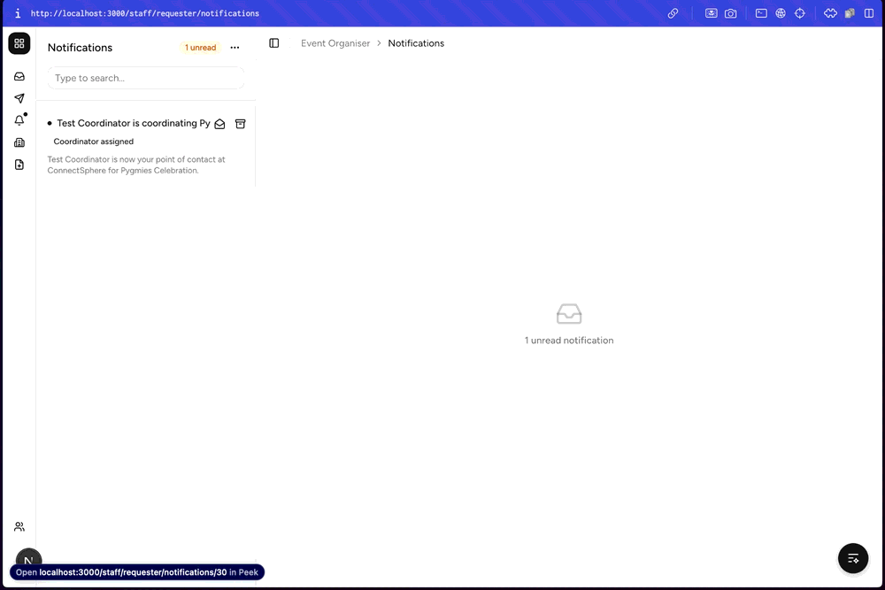
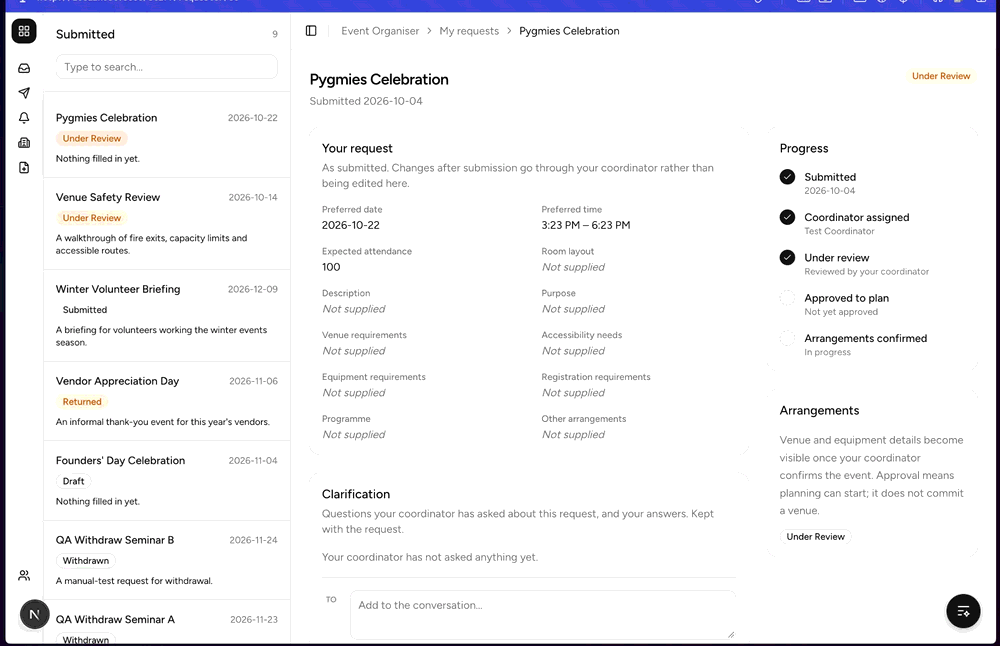
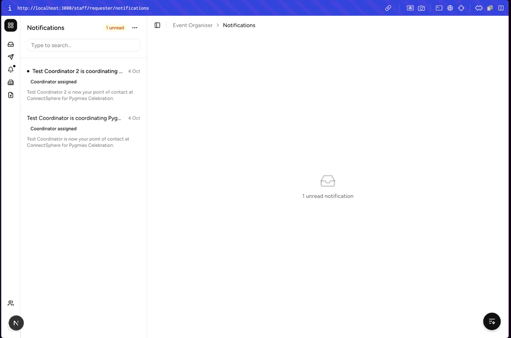
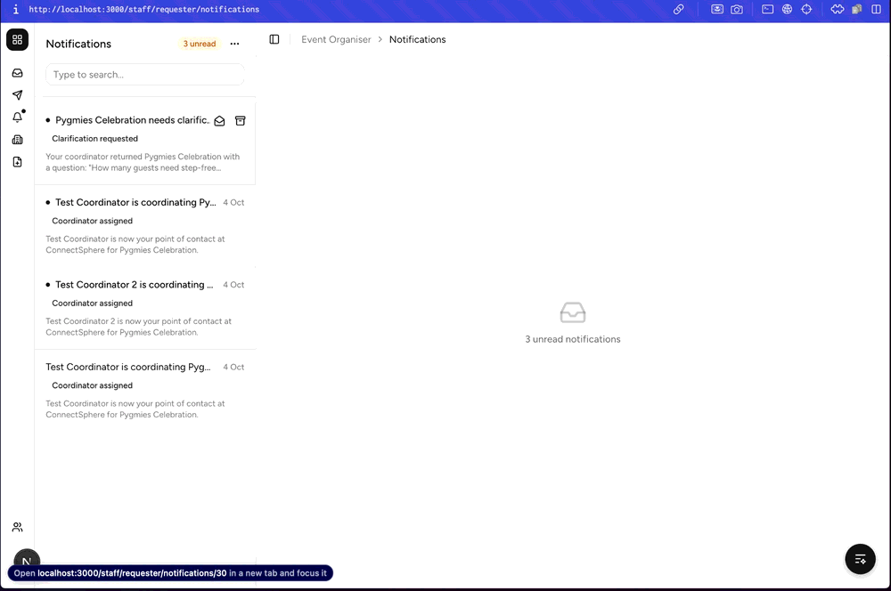
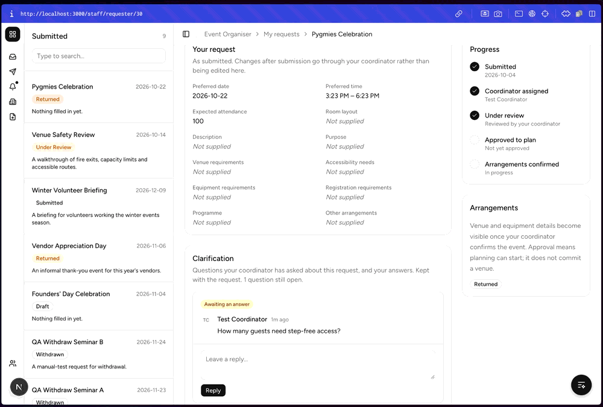

# Organiser Notifications Manual Tests (SPM-58, SPM-59, SPM-60)

## Overview
Manual browser tests for the in-app notifications the Event Organiser receives
when their request gets a coordinator (SPM-58), is returned with a
clarification question (SPM-59), or is approved or rejected (SPM-60).

The inbox is a client component fed by Novu, which vitest does not exercise,
so delivery, opening and read state are checked here. Wording and routing are
covered by the automated `(SPM-58)`, `(SPM-59)` and `(SPM-60)` tests.

These cases are registered as `TC-ORGNOTIFY-001`–`TC-ORGNOTIFY-006` in
[`../tests/manual-registry.csv`](../tests/manual-registry.csv). When you run
them, tick the boxes below **and** report each in the PR description's
`## Manual test results` table. CI records them in
[`manual-runs.csv`](../tests/manual-runs.csv) when the PR merges.

**Last run:** 2026-10-04, local (`pnpm dev:local`, Novu Development), by Isaiah
Chia. All six cases were run. A box left unticked below means that check was
not observed in the run. The SPM-60 screenshots are attached to PR #96 rather
than committed here.

---

## Test Environment Setup

### Prerequisites
- Local Supabase stack seeded from `supabase/seed.sql`
- Novu running locally with the bridge: `pnpm dev:local` (see the README's
  **Notifications** section). Studio should list `organiser-coordinator-assigned`,
  `clarification-requested` and `event-request-decided`.

### Test Accounts (password `TestPass123!`)
- `organiser@test.com` (Event Organiser)
- `lead@test.com` (Event Coordinator Lead)
- `coordinator@test.com` (Event Coordinator, "Test Coordinator")
- `coordinator2@test.com` (Event Coordinator, "Test Coordinator 2"), for TC-ORGNOTIFY-003

### Shared Pre-Conditions
1. As `organiser@test.com`, submit a complete event request. Note its name.
2. Open **Notifications** in the organiser's rail and archive or read anything
   already there, so the unread count starts at zero.

---

## SPM-58: coordinator assigned

### TC-ORGNOTIFY-001 Organiser is told who their coordinator is

**Steps**
1. As `lead@test.com`, assign the request to Test Coordinator.
2. As `organiser@test.com`, open **Notifications**.

**Expected Result**
- [x] One new unread notification, badged **Coordinator assigned**, reading
      "Test Coordinator is coordinating <event>" and "Test Coordinator is now
      your point of contact at ConnectSphere for <event>."
- [ ] `notification` has a row with `trigger_scenario = 'organiser-coordinator-assigned'`,
      the organiser as recipient, and `status = 'Sent'`.

### TC-ORGNOTIFY-002 Opening the notification opens the request and reads it

**Steps**
1. Click the notification from TC-ORGNOTIFY-001.

**Expected Result**
- [x] The organiser's request detail (`/staff/requester/<id>`) opens.
- [x] Back in **Notifications**, the notification is read and the unread dot on
      the rail is gone.

### TC-ORGNOTIFY-003 Reassignment notifies again, naming the new coordinator

**Steps**
1. As `lead@test.com`, reassign the same request to Test Coordinator 2.
2. As `organiser@test.com`, open **Notifications**.
3. As `lead@test.com`, assign Test Coordinator 2 again (no change).

**Expected Result**
- [x] After step 2 there is a second, unread notification naming Test Coordinator 2.
- [ ] Step 3 adds no notification.

## SPM-59: clarification requested

### TC-ORGNOTIFY-004 Organiser is told what the coordinator asked

**Steps**
1. As the assigned coordinator, open the request, type
   `How many guests need step-free access?` and click **Comment & return**.
2. As `organiser@test.com`, open **Notifications** and click the new notification.

**Expected Result**
- [x] The notification is badged **Clarification requested**, reads
      "<event> needs clarification", and quotes the question.
- [x] Clicking it opens the request, showing the question and a reply box.
- [x] The notification is now read.

## SPM-60: review decision

### TC-ORGNOTIFY-005 Approval says planning may begin but nothing is committed

**Steps**
1. As the assigned coordinator, click **Approve** on the request.
2. As `organiser@test.com`, open **Notifications** and click the new notification.

**Expected Result**
- [x] The notification is badged **Request decided**, reads "<event> was
      approved", and says planning can begin but ConnectSphere is not yet
      committed to any arrangement.
- [ ] Clicking it opens the request, and the notification is now read.

### TC-ORGNOTIFY-006 Rejection carries the coordinator's reason

**Steps**
1. Submit and assign a second request, as in the shared pre-conditions.
2. As the assigned coordinator, click **Reject** with the reason
   `The date clashes with a venue closure.`
3. As `organiser@test.com`, open **Notifications** and click the new notification.

**Expected Result**
- [x] The notification reads "<event> was rejected" and gives the reason.
- [x] It does not suggest resubmitting.
- [ ] Clicking it opens the request, and the notification is now read.
